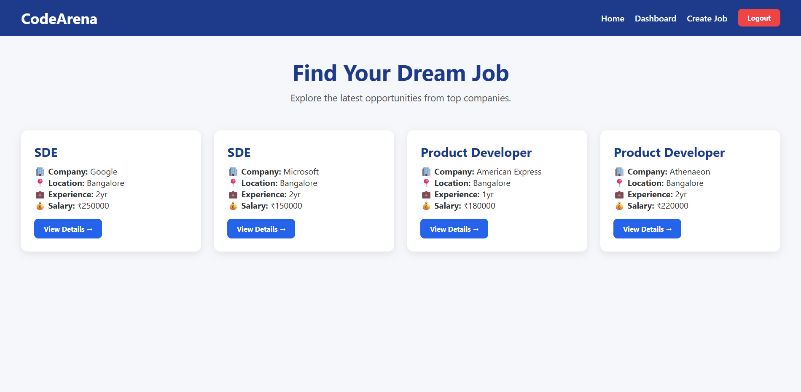
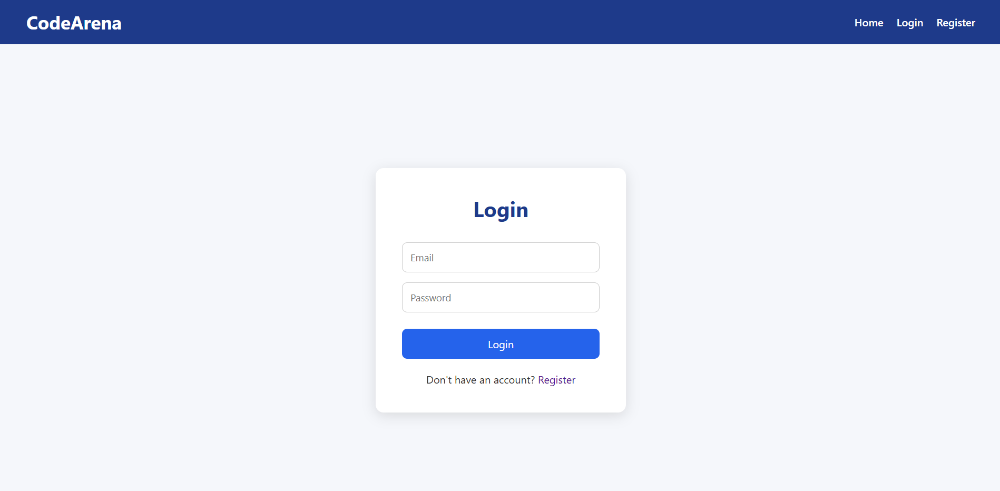
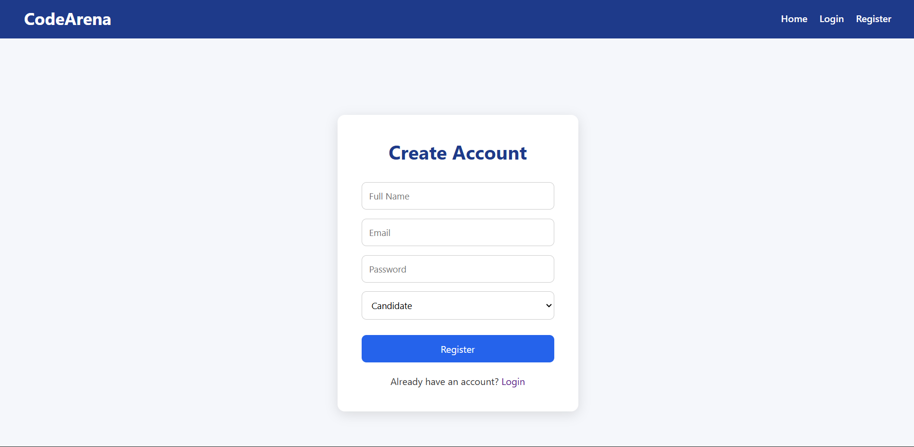
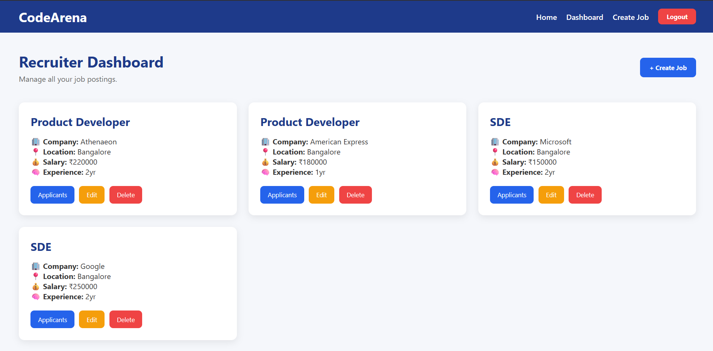
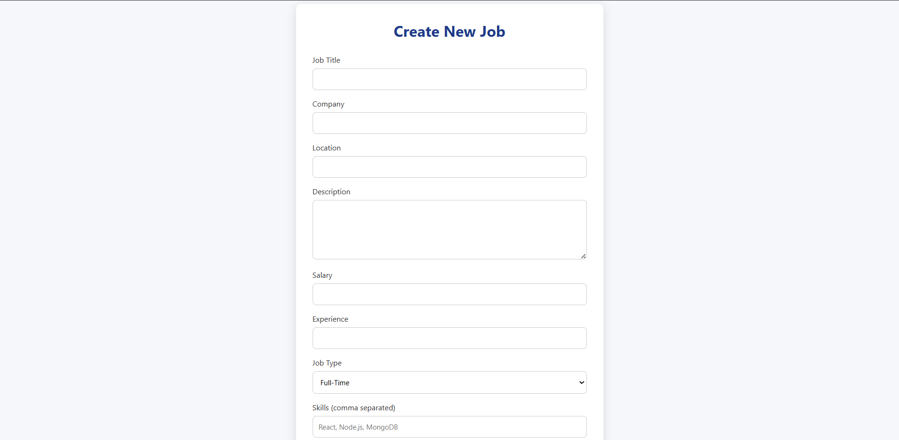
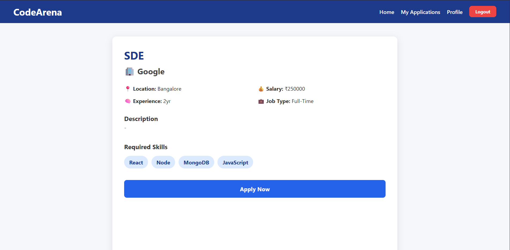
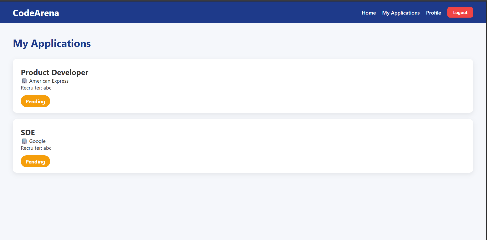
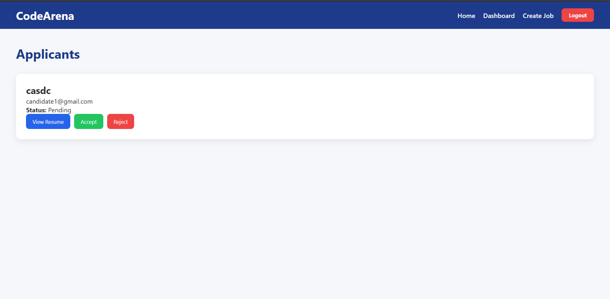

## CodeArena - MERN Job Portal

A full-stack MERN Job Portal that enables recruiters to post and manage jobs while allowing candidates to browse opportunities, upload resumes, and track applications. The application features JWT authentication, role-based access control, Cloudinary resume storage, and a responsive React frontend.

---

## Live Demo

- **Frontend:** https://code-arena-feycnihjf-tejender26.vercel.app
- **Backend API:** https://codearena-0vq3.onrender.com

## Project Preview



---

## Features

### Candidate
- User Registration & Login
- Browse Available Jobs
- Search Jobs
- View Job Details
- Upload Resume (PDF)
- Apply to Jobs
- Track Application Status

### Recruiter
- Secure Recruiter Login
- Create Job Listings
- Edit Existing Jobs
- Delete Jobs
- View Applicants
- View Uploaded Resumes
- Accept / Reject Applications

---

## Tech Stack

### Frontend
- React.js
- React Router
- Axios
- CSS

### Backend
- Node.js
- Express.js
- MongoDB Atlas
- Mongoose
- JWT Authentication
- Multer
- Cloudinary

### Deployment
- Frontend: Vercel
- Backend: Render
- Database: MongoDB Atlas

---

## Folder Structure

```
CodeArena
│
├── client
│   ├── src
│   ├── public
│   └── package.json
│
├── server
│   ├── config
│   ├── controllers
│   ├── middleware
│   ├── models
│   ├── routes
│   └── package.json
│
├── screenshots
└── README.md
```

---

## Screenshots

### Home Page


---

### Login



---

### Register



---

### Recruiter Dashboard



---

### Create Job



---

### Job Details



---

### My Applications



---

### Applicants



---


## Installation

### Clone Repository

```bash
git clone https://github.com/tejender25/CodeArena.git
```

### Install Client

```bash
cd client
npm install
npm run dev
```

### Install Server

```bash
cd server
npm install
npm run dev
```

---

## Environment Variables

Create a `.env` file inside the `server` folder.

```env
PORT=5000

MONGO_URI=your_mongodb_connection_string

JWT_SECRET=your_jwt_secret

CLOUD_NAME=your_cloudinary_cloud_name
API_KEY=your_cloudinary_api_key
API_SECRET=your_cloudinary_api_secret
```

---

## Future Improvements

- Email Notifications
- Saved Jobs
- Company Profiles
- Admin Dashboard
- Interview Scheduling
- AI Resume Screening

---

## Author

**Tejender Singh**

GitHub: https://github.com/tejender25

LinkedIn: https://www.linkedin.com/in/tejender-singh-15b68135a/

---

## License

This project is licensed under the MIT License.